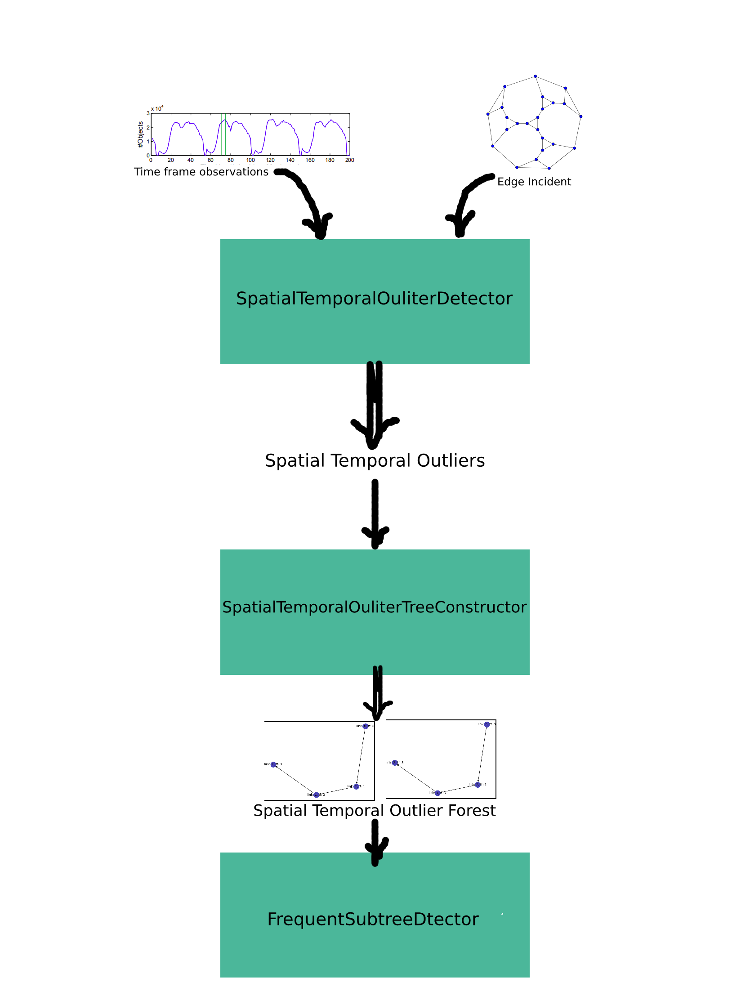

# ocausal
Stream outlier causality relation detecotor.

Ocausal implements a framework provided by a paper titled [Discovering spatio-temporal causal interactions in traffic data streams](https://dl.acm.org/doi/10.1145/2020408.2020571). Although the mentioned paper is concerned with vehicle traffic data, this project is capable of handling outliers of any kind of time frame streams linked to graph-based datasets. 

#### Note
* Some of the tests rely on random data, rerun in case of failure.

#### How it works

